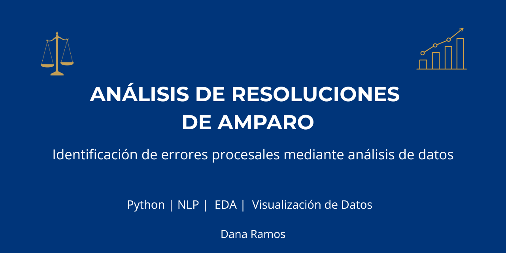
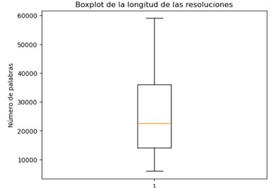
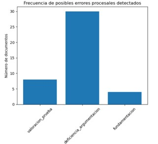
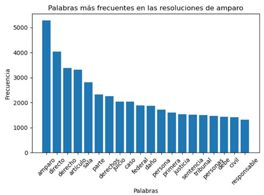
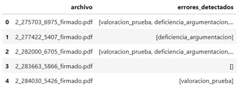

# 📊 Análisis de Resoluciones de Amparo para la Identificación de Errores Procesales

> Proyecto desarrollado como parte del Seminario de Titulación de la **Maestría en Análisis y Visualización de Datos Masivos**.

---

## 📖 Descripción

Este proyecto aplica técnicas de análisis de datos y procesamiento de texto para estudiar resoluciones públicas de amparo directo en materia penal emitidas por el Poder Judicial de la Federación.

A partir de un conjunto de resoluciones judiciales en formato PDF, se desarrolló un flujo completo de extracción, limpieza, transformación y análisis de información con el objetivo de identificar patrones relacionados con errores procesales que motivaron la concesión del amparo.

Más allá del análisis jurídico, el proyecto demuestra la aplicación de metodologías propias de la Ciencia de Datos sobre información no estructurada.

---

# 🎯 Objetivo

Desarrollar un proceso de análisis de datos que permita identificar, clasificar y visualizar patrones de errores procesales presentes en resoluciones públicas de amparo mediante técnicas de procesamiento de texto y análisis exploratorio de datos.

---

# 📂 Conjunto de datos

El análisis se realizó sobre **40 resoluciones públicas de amparo directo** obtenidas del Poder Judicial de la Federación.

Características del conjunto de datos:

* Documentos en formato PDF.
* Información no estructurada.
* Expedientes públicos.
* Casos de amparo concedido.
* Materia penal.

---

# ⚙️ Flujo del proyecto

```text
Resoluciones PDF
        │
        ▼
Extracción de texto
        │
        ▼
Limpieza y normalización
        │
        ▼
Análisis Exploratorio (EDA)
        │
        ▼
Procesamiento de Texto (NLP basado en reglas)
        │
        ▼
Clasificación de errores procesales
        │
        ▼
Visualización de resultados
        │
        ▼
Conclusiones
```

---

# 🛠 Tecnologías utilizadas

### Lenguaje

* Python

### Librerías

* Pandas
* NumPy
* Matplotlib
* PDFPlumber
* NLTK

### Entorno de desarrollo

* Jupyter Notebook

---

# 📈 Actividades desarrolladas

Durante el proyecto se implementó el siguiente flujo de trabajo:

* Extracción automática del texto contenido en resoluciones judiciales en formato PDF.
* Limpieza y normalización del contenido textual.
* Eliminación de caracteres especiales y palabras vacías.
* Tokenización del texto.
* Construcción de variables para el análisis exploratorio.
* Identificación de categorías de errores procesales mediante un enfoque basado en reglas.
* Generación de estadísticas descriptivas.
* Elaboración de visualizaciones para apoyar la interpretación de resultados.

---

# 📊 Resultados principales


El análisis permitió explorar las características del corpus documental e identificar expresiones relacionadas con posibles errores procesales mediante un enfoque basado en reglas.

## Distribución de la longitud de las resoluciones



La longitud de las resoluciones presenta una variabilidad considerable. El diagrama de caja permite identificar documentos considerablemente más extensos que el resto del conjunto, los cuales fueron revisados como posibles valores atípicos sin eliminarlos del análisis.

## Frecuencia de posibles errores procesales



La clasificación permitió observar la frecuencia con la que aparecen distintas categorías asociadas con posibles errores procesales. Entre los conceptos analizados se encuentran la valoración de pruebas, la fundamentación, la motivación, el debido proceso y la presunción de inocencia.

## Palabras frecuentes en las resoluciones



El análisis de frecuencia ayuda a reconocer el vocabulario predominante dentro de las resoluciones. Estos resultados sirven como apoyo exploratorio para comprender el corpus, aunque la presencia frecuente de una palabra no implica por sí sola la existencia de un error procesal.

## Búsqueda de expresiones jurídicas



La búsqueda de expresiones jurídicas permitió localizar fragmentos relevantes dentro de los documentos y construir variables asociadas con las categorías de análisis. Este procedimiento constituye la base del enfoque de clasificación mediante reglas utilizado en el proyecto.

## Síntesis de hallazgos

- Se analizaron 40 resoluciones públicas de amparo directo.
- Se construyó un catálogo inicial de posibles errores procesales.
- Se identificaron patrones relacionados con fundamentación, motivación, valoración de pruebas y debido proceso.
- Se generaron variables auxiliares para cuantificar la cantidad de categorías detectadas en cada documento.
- El análisis confirma la viabilidad de aplicar procesamiento de texto a documentos jurídicos no estructurados.
---

# 💡 Habilidades demostradas

Este proyecto permitió fortalecer competencias en:

* Limpieza y transformación de datos.
* Procesamiento de información no estructurada.
* Análisis Exploratorio de Datos (EDA).
* Procesamiento de Lenguaje Natural (NLP basado en reglas).
* Visualización de datos.
* Interpretación de resultados.
* Documentación técnica.

---

# 📁 Estructura del proyecto

```text
analisis-amparos-procesales/
│
├── data/
│   └── README.md
│
├── images/
│
├── notebooks/
│   └── analisis_amparos.ipynb
│
├── requirements.txt
│
└── README.md
```

---

# ⚠️ Limitaciones

El proyecto tiene un enfoque exploratorio y presenta las siguientes limitaciones:

* El conjunto de datos corresponde únicamente a resoluciones donde el amparo fue concedido.
* La clasificación se realizó mediante reglas y palabras clave previamente definidas.
* El tamaño del conjunto de datos es reducido y no permite entrenar modelos supervisados.

---

# 🚀 Trabajo futuro

Como continuación del proyecto se plantean las siguientes líneas de trabajo:

* Incorporar resoluciones donde el amparo fue negado.
* Incrementar el tamaño del conjunto de datos.
* Aplicar técnicas avanzadas de Procesamiento de Lenguaje Natural (NLP).
* Implementar modelos de clasificación automática.
* Desarrollar un dashboard interactivo para la exploración de resultados.

---

# 👩‍💻 Sobre la autora

**Dana del Carmen Ramos Ramírez**

Licenciada en Informática | Maestría en Análisis y Visualización de Datos Masivos

Interesada en análisis de datos, visualización, inteligencia de negocios y ciencia de datos aplicada a la solución de problemas reales.

---

# 📬 Contacto

* LinkedIn: https://www.linkedin.com/in/dana-ramos-a784b2151/
* GitHub: https://github.com/DanaRamos03
